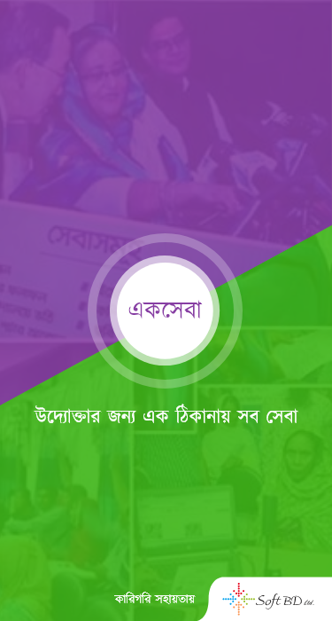
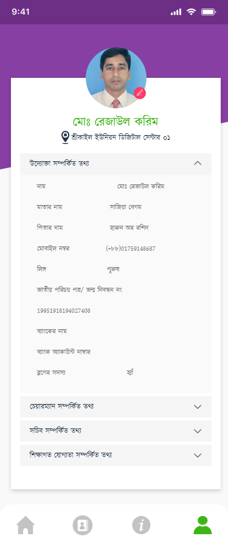
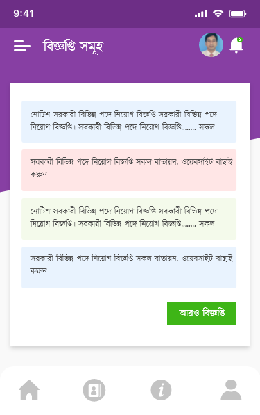
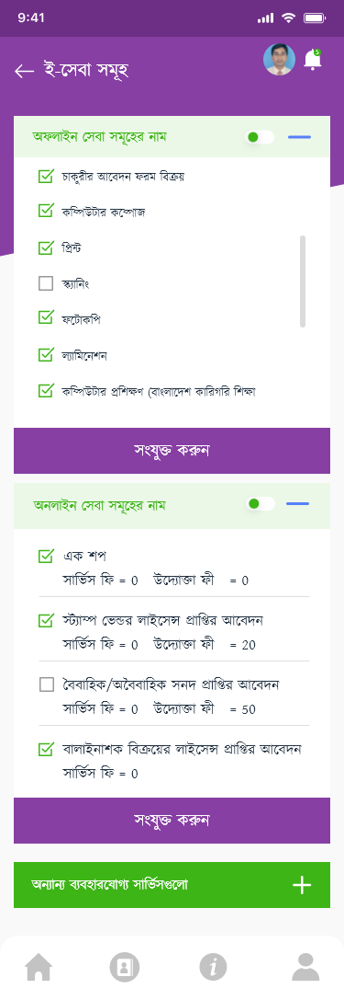

# Ek-sheba
This project is designed for entrepreneurs. Through this platform, entrepreneurs provide government and nongovernment services to people from one place.  
  Some part of our project are given below: 
  SPlash screen 
      
  Sign In 
     
  Profile 
     
  Contact List 
     
  Contact Details 
       
  Notice 
    
  Question & Answer 
      
  E-sheba 
        
  Report 
    
  
  
  
  
  

